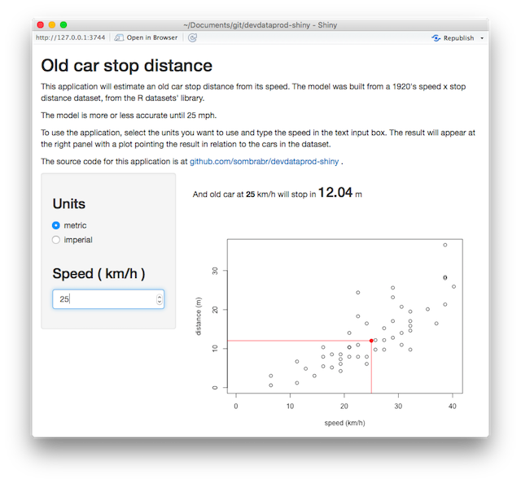

`r library(knitr)`
`r library(caret)`
`r opts_chunk$set(echo=FALSE,message=FALSE,comment="")`

## Summary

The application predicts the stop distance of the car from its speed using
the [shiny](http://shiny.rstudio.com/) framework.

It creates the prediction model from the R dataset <font style="font-weight:bold;color:red;">cars</font>, 
which has `r nrow(cars)` observations with `r ncol(cars)` variables. The data 
in this dataset were recorded in 1920s, so, outdated but good for the framework
demonstration.

This cars dataset has the variable <font style="font-weight:bold;color:red;">speed</font> 
in <font style="font-style:italic;">mph</font> and the variable 
<font style="font-weight:bold;color:red;">distance</font> in
<font style="font-style:italic;">ft</font>, and the application allows the user
to choose the units he wants: metric or imperial.

The conversion between the units are done at the server side before doing the
prediction and at each time the units are changed.

The application can be accessed from the URL:

<https://eduardob.shinyapps.io/devdataprod-shiny/>

--- #center .center

## Application's screen

<div style='text-align: center;'>
    
</div>


---

## The cars dataset

The cars dataset has the distribution below:

```{r fig.align='center'}
plot(cars, xlab="speed", ylab="dist")
```

---

## Linearizing the cars dataset

When doing a linear prediction model, the goal is to maximize the Adjusted
R-squared.

```{r}
m1 <- train(dist ~ speed, data=cars, method="lm") 
```
As seen on the previous slide, the dataset is not very linear. The adjusted 
r-squared from it is `r summary(m1)$adj.r.squared`.

```{r}
m2 <- train(sqrt(dist) ~ speed, data=cars, method="lm") 
```
If the square root of the distance is used instead, the adjusted r-squared is 
improved to `r summary(m2)$adj.r.squared`, so the prediction was done with
the square root of the distance.

```{r fig.height=4, fig.width=4, fig.align='center'}
plot(cars$speed, sqrt(cars$dist), xlab="speed", ylab=expression(sqrt(dist)))
```
